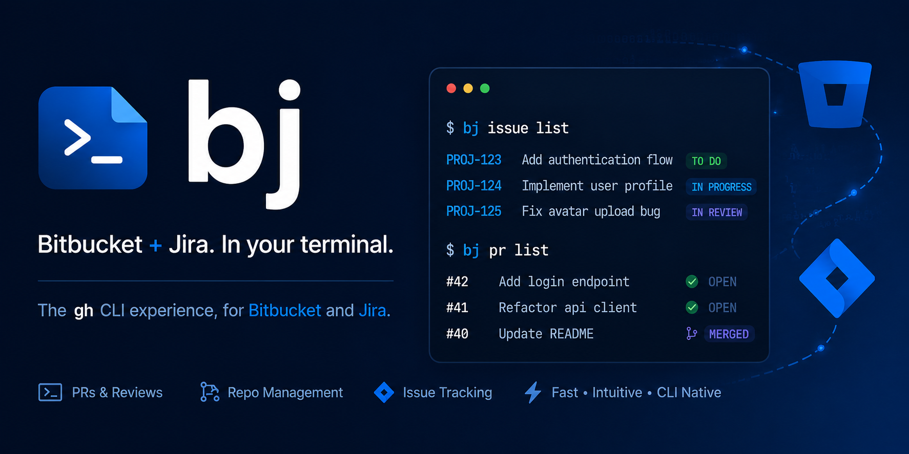

<div class="bj-hero" markdown>

{ .off-glb }

<p class="bj-tagline">A gh-style CLI for Bitbucket pull requests, repos and pipelines, and Jira issues, with branch-name-as-Jira-key automation.</p>

[Get started](installation.md){ .md-button .md-button--primary }
[View on GitHub](https://github.com/Spenhouet/bitbucket-jira-cli){ .md-button }

</div>

<figure markdown="span">
  { .bj-demo }
</figure>

## What it does

<div class="grid cards" markdown>

-   :material-rocket-launch: __One-command install__

    A single `uv` command installs an isolated, self-updating CLI. No virtualenv juggling.

    [:octicons-arrow-right-24: Installation](installation.md)

-   :material-source-pull: __gh-style pull requests__

    Create, view, review and merge Bitbucket pull requests with the same noun-first ergonomics you know from `gh`.

    [:octicons-arrow-right-24: Usage](usage.md)

-   :material-ticket-outline: __Jira issues__

    Search (JQL), view, create, comment on and transition Jira issues without leaving the terminal.

    [:octicons-arrow-right-24: Usage](usage.md)

-   :material-source-branch: __Branch-key automation__

    Your branch name carries the Jira key. `bj` auto-links PRs to tickets and transitions them on create and merge.

    [:octicons-arrow-right-24: Branch-key workflow](guides/branch-key.md)

-   :material-cog-outline: __Pipelines__

    Trigger, list and stream logs for Bitbucket Pipelines, the `gh run` analog.

    [:octicons-arrow-right-24: Pipeline reference](reference/pipeline/index.md)

-   :material-robot-outline: __Ready for coding agents__

    Ships an Agent Skill so AI agents like Claude can drive `bj` the same way they drive `gh`.

    [:octicons-arrow-right-24: Coding agents](guides/agents.md)

</div>

## Get going in 60 seconds

Install, authenticate, ship. That is the whole flow.

### 1. Install

=== "Linux / macOS"

    ```bash
    # Installs an isolated, self-updating CLI via uv.
    curl -LsSf uvx.sh/bitbucket-jira-cli/install.sh | sh
    ```

=== "Windows"

    ```powershell
    powershell -ExecutionPolicy ByPass -c "irm https://uvx.sh/bitbucket-jira-cli/install.ps1 | iex"
    ```

=== "uv"

    ```bash
    # Install as an isolated tool...
    uv tool install bitbucket-jira-cli

    # ...or run it once without installing:
    uvx bitbucket-jira-cli --help
    ```

=== "pip"

    ```bash
    pip install bitbucket-jira-cli
    ```

=== "Docker"

    ```bash
    docker pull spenhouet/bitbucket-jira-cli:latest
    docker run --rm spenhouet/bitbucket-jira-cli --help
    ```

### 2. Authenticate

```bash
bj auth login
```

### 3. Use it

```bash
# On a branch like feature/PROJ-42-thing, open a PR linked to PROJ-42:
bj pr create
bj pr view
bj issue view PROJ-42
```

Detailed setup lives in the [installation docs](installation.md).
